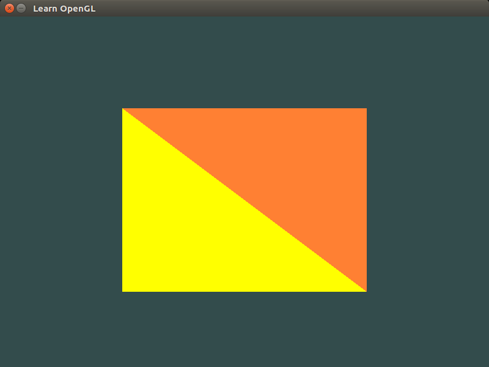
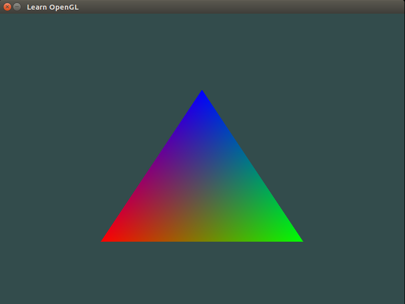

Lecture #2
==========

We continue our discussion about OpenGL, and learn about `vertex` and `fragment`
shaders. The following code shows how to draw two triangles with different
colors.

| **Scribe Notes by Anna Faytelson:** `Source1 <../scribe_notes/lecture2_notes_Anna_Faytelson.zip>`_ `PDF1 <../scribe_notes/lecture2_notes_Anna_Faytelson.pdf>`_
| **Scribe Notes by Abhishek Sutrave:** `Source2 <../scribe_notes/lecture2_notes_Abhishek_Sutrave.docx>`_ `PDF2 <../scribe_notes/lecture2_notes_Abhishek_Sutrave.pdf>`_

::

    #include <GL/glew.h>
    #include <GLFW/glfw3.h>
    #include <iostream>
    
    void key_callback(GLFWwindow* window,int key,int scancode,int action,int mode)
    {
        if(key==GLFW_KEY_ESCAPE && action==GLFW_PRESS)
            glfwSetWindowShouldClose(window,GL_TRUE);
    }
    
    // vertex shader
    const GLchar* vertex_shader_source="# version 330 core\n"
            "layout (location=0) in vec3 position;\n"
            "void main()\n"
            "{\n"
            "gl_Position = vec4(position.x,position.y,position.z,1.0);\n"
            "}\0";
    
    // fragment shaders
    const GLchar* fragment_shader_source1="# version 330 core\n"
            "out vec4 color;\n"
            "void main()\n"
            "{\n"
            "color=vec4(1.0f,0.5f,0.2f,1.0f);\n"
            "}\0";
    
    const GLchar* fragment_shader_source2="# version 330 core\n"
            "out vec4 color;\n"
            "void main()\n"
            "{\n"
            "color=vec4(1.0f,1.0f,0.0f,1.0f);\n"
            "}\0";
    
    int main()
    {
        glfwInit();
    #if __APPLE__
        glfwWindowHint(GLFW_OPENGL_FORWARD_COMPAT,GL_TRUE);
    #endif
        glfwWindowHint(GLFW_CONTEXT_VERSION_MAJOR,3);
        glfwWindowHint(GLFW_CONTEXT_VERSION_MINOR,3);
        glfwWindowHint(GLFW_OPENGL_PROFILE,GLFW_OPENGL_CORE_PROFILE);
        glfwWindowHint(GLFW_RESIZABLE,GL_FALSE);
    
        GLFWwindow *window=glfwCreateWindow(800,600,"Learn OpenGL",nullptr,nullptr);
        if(window==nullptr)
        {
            std::cout<<"Failed to create GLFW window!"<<std::endl;
            glfwTerminate();
            return -1;
        }
        glfwMakeContextCurrent(window);
    
        glewExperimental=GL_TRUE;
        if(glewInit()!=GLEW_OK)
        {
            std::cout<<"Failed to initialize GLEW!"<<std::endl;
            return -1;
        }
    
        int width,height;
        glfwGetFramebufferSize(window,&width,&height);
        glViewport(0,0,width,height);
    
        glfwSetKeyCallback(window,key_callback);
    
        GLfloat vertices[]={
             0.5f,  0.5f, 0.0f,
             0.5f, -0.5f, 0.0f,
            -0.5f, -0.5f, 0.0f,
            -0.5f,  0.5f, 0.0f
        };
    
        GLuint indices1[]={
            0, 1, 3
        };
    
        GLuint indices2[]={
            1, 2, 3
        };
    
        // create vertex buffer object
        GLuint VBO;
        glGenBuffers(1,&VBO);
    
        // create element buffer objects
        GLuint EBO[2];
        glGenBuffers(2,EBO);
    
        // vertex shader
        GLuint vertex_shader=glCreateShader(GL_VERTEX_SHADER);
        glShaderSource(vertex_shader,1,&vertex_shader_source,NULL);
        glCompileShader(vertex_shader);
    
        GLint success;
        GLchar info_log[512];
        glGetShaderiv(vertex_shader,GL_COMPILE_STATUS,&success);
        if(!success)
        {
            glGetShaderInfoLog(vertex_shader,512,NULL,info_log);
            std::cout<<"Error! Vertex Shader::Compilation Failed!"<<std::endl<<info_log<<std::endl;
        }
    
        // fragment shaders
        GLuint fragment_shader1=glCreateShader(GL_FRAGMENT_SHADER);
        glShaderSource(fragment_shader1,1,&fragment_shader_source1,NULL);
        glCompileShader(fragment_shader1);
    
        glGetShaderiv(fragment_shader1,GL_COMPILE_STATUS,&success);
        if(!success)
        {
            glGetShaderInfoLog(fragment_shader1,512,NULL,info_log);
            std::cout<<"Error! Fragment Shader::Compilation Failed!"<<std::endl<<info_log<<std::endl;
        }
    
        GLuint fragment_shader2=glCreateShader(GL_FRAGMENT_SHADER);
        glShaderSource(fragment_shader2,1,&fragment_shader_source2,NULL);
        glCompileShader(fragment_shader2);
    
        glGetShaderiv(fragment_shader2,GL_COMPILE_STATUS,&success);
        if(!success)
        {
            glGetShaderInfoLog(fragment_shader2,512,NULL,info_log);
            std::cout<<"Error! Fragment Shader::Compilation Failed!"<<std::endl<<info_log<<std::endl;
        }
    
        // shader programs
        GLuint shader_program1=glCreateProgram();
        glAttachShader(shader_program1,vertex_shader);
        glAttachShader(shader_program1,fragment_shader1);
        glLinkProgram(shader_program1);
    
        glGetProgramiv(shader_program1,GL_LINK_STATUS,&success);
        if(!success)
        {
            glGetProgramInfoLog(shader_program1,512,NULL,info_log);
            std::cout<<"Error! Shader Program::Linking Failed!"<<std::endl<<info_log<<std::endl;
        }
    
        GLuint shader_program2=glCreateProgram();
        glAttachShader(shader_program2,vertex_shader);
        glAttachShader(shader_program2,fragment_shader2);
        glLinkProgram(shader_program2);
    
        glGetProgramiv(shader_program2,GL_LINK_STATUS,&success);
        if(!success)
        {
            glGetProgramInfoLog(shader_program2,512,NULL,info_log);
            std::cout<<"Error! Shader Program::Linking Failed!"<<std::endl<<info_log<<std::endl;
        }
    
        glDeleteShader(vertex_shader);
        glDeleteShader(fragment_shader1);
        glDeleteShader(fragment_shader2);
    
        // create vertex array objects
        GLuint VAO[2];
        glGenVertexArrays(2,VAO);
    
        // bind vertex array object
        glBindVertexArray(VAO[0]);
        // copy the vertices in a vertex buffer
        glBindBuffer(GL_ARRAY_BUFFER,VBO);
        glBufferData(GL_ARRAY_BUFFER,sizeof(vertices),vertices,GL_STATIC_DRAW);
        // copy the index array in an element buffer
        glBindBuffer(GL_ELEMENT_ARRAY_BUFFER,EBO[0]);
        glBufferData(GL_ELEMENT_ARRAY_BUFFER,sizeof(indices1),indices1,GL_STATIC_DRAW);
        // set vertex attribute pointers
        glVertexAttribPointer(0,3,GL_FLOAT,GL_FALSE,3*sizeof(GL_FLOAT),(GLvoid*)0);
        glEnableVertexAttribArray(0);
        // unbind the vertex array object
        glBindVertexArray(0);
    
        // bind vertex array object
        glBindVertexArray(VAO[1]);
        // copy the vertices in a vertex buffer
        glBindBuffer(GL_ARRAY_BUFFER,VBO);
        glBufferData(GL_ARRAY_BUFFER,sizeof(vertices),vertices,GL_STATIC_DRAW);
        // copy the index array in an element buffer
        glBindBuffer(GL_ELEMENT_ARRAY_BUFFER,EBO[1]);
        glBufferData(GL_ELEMENT_ARRAY_BUFFER,sizeof(indices2),indices2,GL_STATIC_DRAW);
        // set vertex attribute pointers
        glVertexAttribPointer(0,3,GL_FLOAT,GL_FALSE,3*sizeof(GL_FLOAT),(GLvoid*)0);
        glEnableVertexAttribArray(0);
        // unbind the vertex array object
        glBindVertexArray(0);
    
        //glPolygonMode(GL_FRONT_AND_BACK,GL_LINE);
    
        while(!glfwWindowShouldClose(window))
        {
            glfwPollEvents();
    
            glClearColor(.2f,.3f,.3f,1.f);
            glClear(GL_COLOR_BUFFER_BIT);
    
            // use shader programs
            glUseProgram(shader_program1);
            glBindVertexArray(VAO[0]);
            glDrawElements(GL_TRIANGLES,3,GL_UNSIGNED_INT,0);
            glBindVertexArray(0);
    
            glUseProgram(shader_program2);
            glBindVertexArray(VAO[1]);
            glDrawElements(GL_TRIANGLES,3,GL_UNSIGNED_INT,0);
            glBindVertexArray(0);
    
            glfwSwapBuffers(window);
        }
    
        // deallocate all resources
        glDeleteVertexArrays(2,VAO);
        glDeleteBuffers(1,&VBO);
        glDeleteBuffers(2,EBO);
        // terminate GLFW
        glfwTerminate();
    
        return 0;
    }

Save this file as ``main.cpp``. To compile the code, run the following command: ::

    g++ -O3 main.cpp -o triangle -lGLEW -lglfw -lGL -lX11 -lpthread -lXrandr -ldl -lXxf86vm -lXinerama -lXcursor -lrt -lm -std=c++11

This will create a binary ``triangle``, and now if you execute the following command: ::

    ./triangle

then you should see a new window (like the one shown below) pop-up on your screen:

Execute the following command to run this code on Mac OS: ::

    g++ -O3 main.cpp -o triangle -lGLEW -lglfw -framework OpenGL -ldl -lm -std=c++11

As you can see, writing OpenGL code can quickly become quite cumbersome as many
initializations and checks need to be executed to make sure that everything was
setup correctly. However, this is where we can exploit the power of C++, in
particular, its *Object-Oriented Principle* to reduce code complexity. In the
following example, we will create a new class ``Shader`` that will abstract away
from the user all the intricacies involved in creating a new shader program,
making it much easier and user-friendly. ::

    #ifndef SHADER_H
    #define SHADER_H
    
    #include <string>
    #include <fstream>
    #include <sstream>
    #include <iostream>
    
    #include <GL/glew.h>
    
    class Shader
    {
      public:
        // the shader program id
        GLuint program;
    
        Shader(const GLchar* vertex_path,const GLchar* fragment_path)
        {
            // retrieve the vertex/fragment source code
            std::string vertex_code,fragment_code;
            std::ifstream vertex_shader_file,fragment_shader_file;
    
            // ensures ifstream objects can throw exceptions
            vertex_shader_file.exceptions(std::ifstream::badbit);
            fragment_shader_file.exceptions(std::ifstream::badbit);
    
            try{
                // open files
                vertex_shader_file.open(vertex_path);
                fragment_shader_file.open(fragment_path);
                std::stringstream vertex_shader_stream,fragment_shader_stream;
    
                // read file's buffer contents into streams
                vertex_shader_stream<<vertex_shader_file.rdbuf();
                fragment_shader_stream<<fragment_shader_file.rdbuf();
    
                // close file handlers
                vertex_shader_file.close();
                fragment_shader_file.close();
    
                // convert stream into string
                vertex_code=vertex_shader_stream.str();
                fragment_code=fragment_shader_stream.str();
            }
            catch(std::ifstream::failure e){
                std::cout<<"Error::Shader::File Not Successfully Read!"<<std::endl;
            }
    
            const GLchar* vertex_shader_code=vertex_code.c_str();
            const GLchar* fragment_shader_code=fragment_code.c_str();
    
            // compile shaders
            GLuint vertex,fragment;
            GLint success;
            GLchar info_log[512];
    
            // vertex shader
            vertex=glCreateShader(GL_VERTEX_SHADER);
            glShaderSource(vertex,1,&vertex_shader_code,NULL);
            glCompileShader(vertex);
            // print compile errors if any
            glGetShaderiv(vertex,GL_COMPILE_STATUS,&success);
            if(!success)
            {
                glGetShaderInfoLog(vertex,512,NULL,info_log);
                std::cout<<"Error::Shader::Vertex::Compilation Failed!"<<std::endl<<info_log<<std::endl;
            }
    
            // fragment shader
            fragment=glCreateShader(GL_FRAGMENT_SHADER);
            glShaderSource(fragment,1,&fragment_shader_code,NULL);
            glCompileShader(fragment);
            // print compile errors if any
            glGetShaderiv(fragment,GL_COMPILE_STATUS,&success);
            if(!success)
            {
                glGetShaderInfoLog(fragment,512,NULL,info_log);
                std::cout<<"Error::Shader::Fragment::Compilation Failed!"<<std::endl<<info_log<<std::endl;
            }
    
            // shader program
            this->program=glCreateProgram();
            glAttachShader(this->program,vertex);
            glAttachShader(this->program,fragment);
            glLinkProgram(this->program);
            // print linking errors if any
            glGetProgramiv(this->program,GL_LINK_STATUS,&success);
            if(!success)
            {
                glGetProgramInfoLog(this->program,512,NULL,info_log);
                std::cout<<"Error::Shader::Program::Linking Failed!"<<std::endl<<info_log<<std::endl;
            }
    
            // delete the shaders as they are now linked into our program and no longer necessary
            glDeleteShader(vertex);
            glDeleteShader(fragment);
        }
    
        void Use()
        {glUseProgram(this->program);}
    };
    #endif

Save the above code in a file called ``Shader.h``. Now open up a new file and
type in the following code below: ::

    #include <GL/glew.h>
    #include <GLFW/glfw3.h>
    #include <cmath>
    
    #include "Shader.h"
    
    void key_callback(GLFWwindow* window,int key,int scancode,int action,int mode)
    {
        if(key==GLFW_KEY_ESCAPE && action==GLFW_PRESS)
            glfwSetWindowShouldClose(window,GL_TRUE);
    }
    
    int main()
    {
        glfwInit();
    #if __APPLE__
        glfwWindowHint(GLFW_OPENGL_FORWARD_COMPAT,GL_TRUE);
    #endif
        glfwWindowHint(GLFW_CONTEXT_VERSION_MAJOR,3);
        glfwWindowHint(GLFW_CONTEXT_VERSION_MINOR,3);
        glfwWindowHint(GLFW_OPENGL_PROFILE,GLFW_OPENGL_CORE_PROFILE);
        glfwWindowHint(GLFW_RESIZABLE,GL_FALSE);
    
        GLFWwindow *window=glfwCreateWindow(800,600,"Learn OpenGL",nullptr,nullptr);
        if(window==nullptr)
        {
            std::cout<<"Failed to create GLFW window!"<<std::endl;
            glfwTerminate();
            return -1;
        }
        glfwMakeContextCurrent(window);
    
        glewExperimental=GL_TRUE;
        if(glewInit()!=GLEW_OK)
        {
            std::cout<<"Failed to initialize GLEW!"<<std::endl;
            return -1;
        }
    
        int width,height;
        glfwGetFramebufferSize(window,&width,&height);
        glViewport(0,0,width,height);
    
        glfwSetKeyCallback(window,key_callback);
    
        Shader our_shader("shader.vs","shader.frag");
    
        GLfloat vertices[]={
            // positions        // colors
            -0.5f, -0.5f, 0.0f, 1.0f, 0.0f, 0.0f,
             0.5f, -0.5f, 0.0f, 0.0f, 1.0f, 0.0f,
             0.0f,  0.5f, 0.0f, 0.0f, 0.0f, 1.0f
        };
    
        GLuint VAO,VBO;
        glGenBuffers(1,&VBO);
        glGenVertexArrays(1,&VAO);
    
        // bind vertex array object
        glBindVertexArray(VAO);
    
        // copy the vertices in a buffer
        glBindBuffer(GL_ARRAY_BUFFER,VBO);
        glBufferData(GL_ARRAY_BUFFER,sizeof(vertices),vertices,GL_STATIC_DRAW);
    
        // set position attribute pointers
        glVertexAttribPointer(0,3,GL_FLOAT,GL_FALSE,6*sizeof(GL_FLOAT),(GLvoid*)0);
        glEnableVertexAttribArray(0);
        // set color attribute pointers
        glVertexAttribPointer(1,3,GL_FLOAT,GL_FALSE,6*sizeof(GL_FLOAT),(GLvoid*)(3*sizeof(GLfloat)));
        glEnableVertexAttribArray(1);
    
        // unbind the vertex array object
        glBindVertexArray(0);
    
        while(!glfwWindowShouldClose(window))
        {
            glfwPollEvents();
            glClearColor(.2f,.3f,.3f,1.f);
            glClear(GL_COLOR_BUFFER_BIT);
    
            // use shader program
            our_shader.Use();
    
            // draw
            glBindVertexArray(VAO);
            glDrawArrays(GL_TRIANGLES,0,3);
            glBindVertexArray(0);
    
            glfwSwapBuffers(window);
        }
    
        // deallocate all resources
        glDeleteVertexArrays(1,&VAO);
        glDeleteBuffers(1,&VBO);
        // terminate GLFW
        glfwTerminate();
    
        return 0;
    }

Save this file as ``main.cpp``. You will need to create two additional files for
the vertex and fragment shaders. Open a new file and type the following code: ::

    #version 330 core
    layout (location=0) in vec3 position;
    layout (location=1) in vec3 color;
    
    out vec3 our_color;
    
    void main()
    {
        gl_Position=vec4(position,1.0f);
        our_color=color;
    }

Save this file as ``shader.vs``. Open another file and type the following
command: ::

    #version 330 core
    in vec3 our_color;
    out vec4 color;
    
    void main()
    {
        color=vec4(our_color,1.0f);
    }

Save this file as ``shader.frag``. If you did everything right, then you should
see four new files in your folder now: ``Shader.h``, ``main.cpp``,
``shader.vs``, and ``shader.frag``. To compile the code, run the following
command: ::

    g++ -O3 main.cpp -o triangle -lGLEW -lglfw -lGL -lX11 -lpthread -lXrandr -ldl -lXxf86vm -lXinerama -lXcursor -lrt -lm -std=c++11

This will create a binary ``triangle``, and now if you execute the following command: ::

    ./triangle

then you should see a new window (like the one shown below) pop-up on your screen:

Execute the following command to run this code on Mac OS: ::

    g++ -O3 main.cpp -o triangle -lGLEW -lglfw -framework OpenGL -ldl -lm -std=c++11

Note that this example is a bit different from the previous example, in the
sense that we specified a *color* attribute per vertex (unlike the previous
example where color was associated with the fragment shader). In this case, the
fragment shader *automatically* blends the colors, as shown above.
